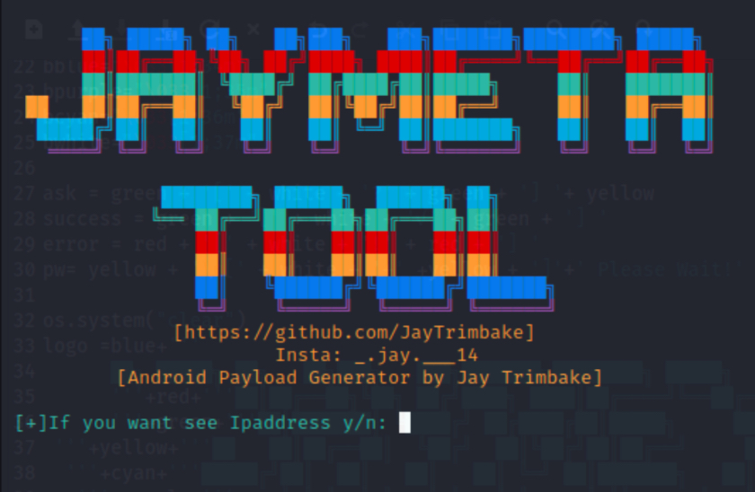

<!-- JayMeta Tool -->

<p align="center">
  
</p>

<p align="center">JayMeta Tool</p>


### Installation

- Just, Clone this repository -
```
$ git clone https://github.com/JayTrimbake/jaymeta.git
```

- Change to cloned directory and run `python3 jaymeta.py` -
```
$ cd jaymeta
$ python3 jaymeta.py
```

### Dependencies

**`jaymeta`** requires following programs to run properly - 
- `python3`

> Supported Platform :**`Kali Linux Only`**,

### Find Me on :
<p align="left">
  <a href="https://github.com/JayTrimbake" target="_blank"></a>
  <a href="https://www.instagram.com/_.jay.___14" target="_blank"></a>
  <a href="https://www.youtube.com/channel/UCPcgqEH9d3Cx6l4RqYuF7LA" target="_blank"></a>
  
</p>
